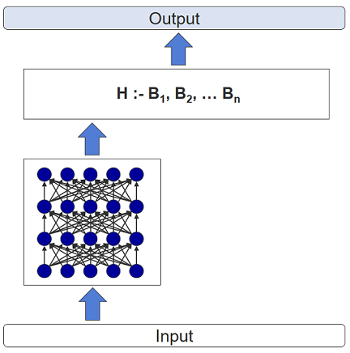

# AI Assignment

- **Authors:** Robin Roth, Christian Roth
- **Semester:** HS 2020

This repository contains the deliverables of the assignment for the module "AI-Technologies".
The assignment consitsted of three parts.

- Expert Knowledge (using KE)
- Extracting Knowledge (using ML)
- Combining KE and ML

This document serves as the last delivereable. Namely, a documentation of how the proir steps we realized.


## Transforming Expert Knowledge into a Knowledge System

The knowledge system chosen for this assignment was the `Prolog`-language.
This because it is the system taught in the course.
The task at hand, was to transform the doucumented knowledge found in the assignment into formal knowldege the system can understand.
The ultimate goal of the system is to feed it a set of people, and have it evaluate, which of them are eligible for an insuarance, which are not and which people are, provided they pay an extra fee.

In order to achieve this, the text needed to be split up in a set of rules.
Before we even started to write any rules in `Prolog`, we created the following desicion tree, that shows, which descisions need to be made, by the system.


We've created a set of sample patients to test our rules with. Each one, with the exception of two had at least one feature, that would prevent him from beign eligible.

The rules were implemented in the exact order shown in the decision tree.
The "questions" they answer were explicitly phrased in a way, where a negative answer would disqualify the patient from being eligible and a positive answer would get him into the next "stage".
That way we can check eligibility by simply chaining these rules together with a logical "AND" or `,` in Prolog sytax.

There are two rules checking for appropriate age.

```prolog
% people younger than 21 are not eligible
old_enough(X) :- person(X), age(X,Y), Y > 21.

% people older than 70 are not eligible
young_enough(X) :- person(X), age(X,Y), Y < 70.
```

Then we check wheter the patient is a swiss ciitzen. If he isn't hes automatically disqualified.

```prolog
% people living in switzerland are eligible
swiss(X) :- person(X), citizen(X,Y), Y = ch.
```

As people with hearing defects are also not eligible, we next check, wheter they suffer form a hearing impairment.
So, if the patien does NOT have this "disease", he is still eligible.

```prolog
% people with hearing defects are not eligble
good_hearing(X) :- person(X), \+ patient(X, hearing).
```

A mental illness can mean exclusion, but only if the patient is over 65 years of age.
Therefore if a patient is over 65 we need to check if he has a mental ilness.

```prolog
% people older than 65 and suffer from mental ilnesses are not eligble
mental_check(X) :- person(X), \+ (age(X, Y), Y > 65, patient(X, mental)).
```

As a patient with three diseases is a high risk patient, we need to be able to count diseases. We implemented this rule as follows.

```prolog
% count number of elements in a list (recursive)
% code found here (https://stackoverflow.com/questions/44999026/counting-list-size-resulting-from-a-findall-not-working-in-prolog)
list_length([] , 0 ).
list_length([_|Xs] , L ) :- 
        list_length(Xs,N) , 
        L is N+1 .

% list of diseases a given patient has
disease_list(X,L) :- findall(Y, patient(X,Y),L).

% check if patient has more than two diseases
more_than_two_diseases(X, List, Count) :- disease_list(X, List), list_length(List, Count), Count > 2.

% people having three or more diseases
high_risk_value(X) :- person(X), more_than_two_diseases(X, _, _).
```

A medium risk patient suffers from mental illness OR has 2 diseases.

```prolog
% people older than 55 AND (suffer from mental ilnesses OR having 2 diseases)
medium_risk_value(X) :- person(X), (age(X,Y), Y > 55, patient(X, mental)).
```

Low risk patient are the remaining people, who are neither high- nor medium risk.

```prolog
% people whose risk values are not high and medium --> low
low_risk_value(X) :- person(X), \+ (medium_risk_value(X);  high_risk_value(X)).
```

As a very last step, we want to just be able to check if a patient is eligible and
 in the case of a medium risk value, if any extra fee applies.

```prolog
% is person eilgible for insurance?
eligible(X) :- person(X), old_enough(X), young_enough(X), swiss(X), good_hearing(X), 
    mental_check(X), \+ high_risk_value(X).

% does person have to pay an extra fee?
extra_fee(X) :- eligible(X), medium_risk_value(X).
```

Our defintion of the rules in `Prolog` can be seen in this document [expert.pl](https://github.com/sekthor/ai-assignment/blob/master/expert.pl).


## Knowledge Extraction from Sheet

The knowledge extraction for this assignment is done by a script written in python.
This because it is the system taught in the course.
We used different libraries, such as `scipy.io`, `pandas`, `sklearn`, `matplotlib` and `tensorflow`.
The task at hand, was to analyze the data from former applications,
in order to see which applications result into which risk value.
The data from former applications can be seen in this document [Project_Learning.arff](https://github.com/sekthor/ai-assignment/blob/master/Project_Learning.arff).

We went through the following 9 steps to extract the knowledge out of the data-sheet:
1. Load the data from the file, put it in a pandas-dataframe and transform byte-strings into strings
2. Convert all strings into numbers with a sklearn-encoder:
    - attributes allergies, medications: "yes" --> 1 and "no" --> 0
    - attribut disease: value "cholesterol" --> 0, "diabetes" --> 1, "heart" --> 2 and "no" --> 3
3. Visualize the data by comparing all features with each other.
4. Split the data into feature matrix and target array. The feature matrix contains all attributes except the risk values.
The target matrix contains only the risk values.
5. Split the data into training-set and test-set.
6. Build a model.
7. Fit the model to the training-set.
8. Make a prediction with the testing-set.
9. Compare the accuracy of the predication.

The python script can be seen on google colab [knowledge_extraction.ipynb](https://colab.research.google.com/drive/1YQTKCYbEk49Kla6bi7dIiX1yr1KsCPyY?usp=sharing)


## Combining KE and ML

In the last lecutre of the course we have looked at different possibilities to combine Knowledge Engineering and Machine Learning.
As we now have two independently working systems, the question arises, how to best combine them.
We have considered the different possibilites and with how the two systems have turned out, we belive a "chaining" to be the best method.

This means, the data will be fist categorized by the Machine Learning model.
It has the capability to classify the patients into low, medium and high risk patients.
This information could then be fed on to our Prolog Knowledge base where the explicit rules can further narrow down the selection of eligible patients.


