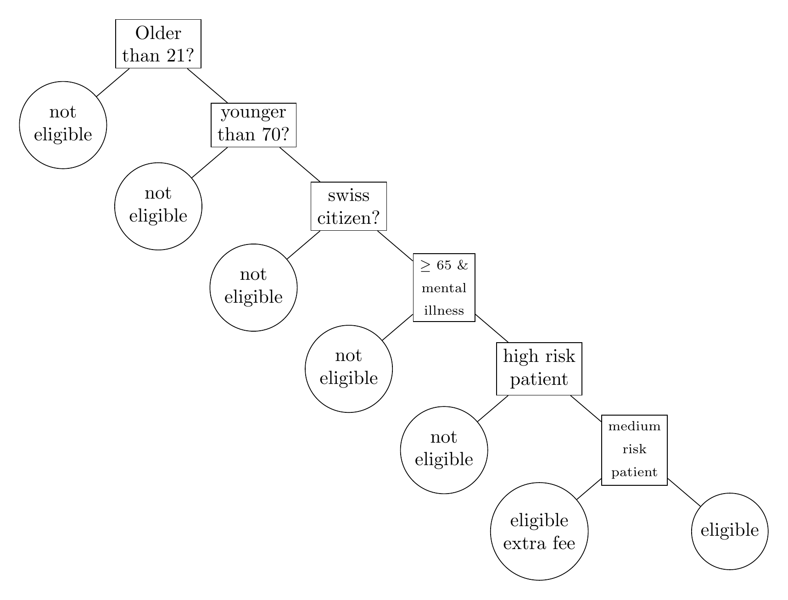

# AI Assignment

- **Authors:** Robin Roth, Christian Roth
- **Semester:** HS 2020

This repository contains the deliverables of the assignment for the modlue "AI-Technologies".
The assignment consitsted of three parts.

- Expert Knowledge (using KE)
- Extracting Knowledge (using ML)
- Combining KE and ML

This document serves as the last delivereable. Namely, a documentation of how the proir steps we relaized.

## Transforming Expert Knowledge into a Knowledge System

The knowledge system chosen for this assignment was the `Prolog`-language.
This because it is the system taught in the course.
The task at hand, was to transform the doucumented knowledge found in the assignment into formal knowldege the system can understand.
The ultimate goal of the system is to feed it a set of people, and have it evaluate, which of them are eligible for an insuarance, which are not and which people are, provided they pay an extra fee.

In order to achieve this, the text needed to be split up in a set of rules.
Before we even started to write any rules in Prolog, we created the following desicion tree, that shows, which descisions need to be made, by the system.

## Knowledge Extraction from Sheet

## Combining KE and ML
